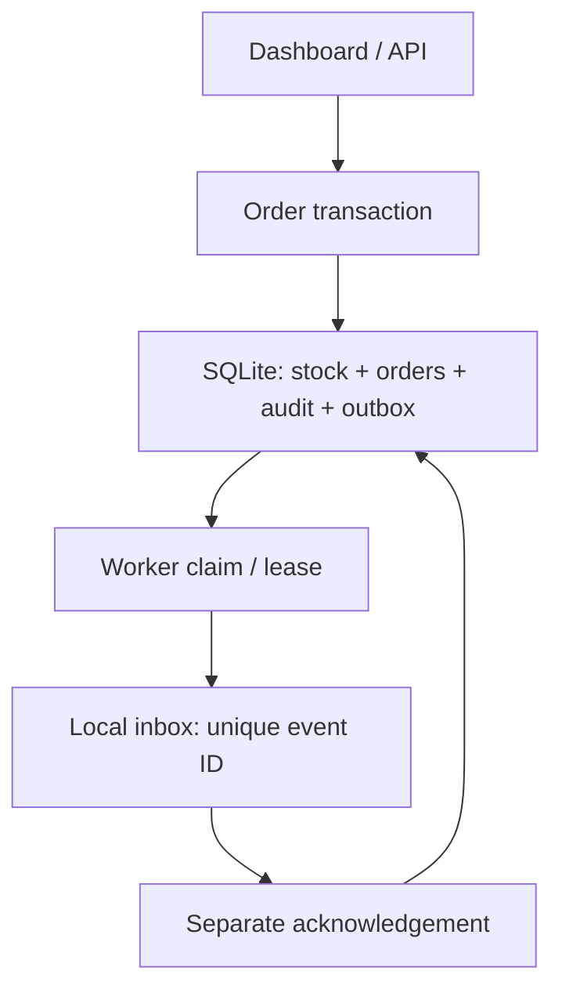
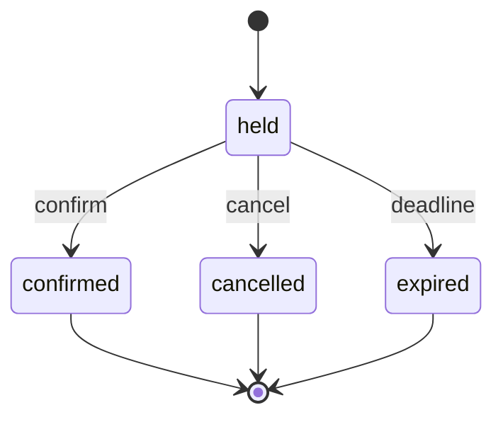

# Architecture and design decisions

## Atomic boundary
Stock decrement, all order lines, audit, and outbox insert are in one `BEGIN IMMEDIATE` transaction. SQLite serializes writers. An insufficient line raises an exception and rolls the entire order back. The request key and canonical payload fingerprint distinguish a safe retry from an accidental different order.

Two examples: the first SKU reserves successfully but the second fails, so both revert; two identical requests run concurrently, so only one order and one initial event persist.

## Order state machine

Cleanup uses `expires <= now`. Terminal actions are idempotent only when repeating the same final action. A confirmed order cannot be cancelled; refunds require a separate future design. Request keys remain bound after expiry.

## Delivery and recovery
A claim increments attempts and records a token plus 15-second lease. Success requires the current claim token and an unexpired lease. Failures wait 2, 4, or 8 seconds before another claim; the third failure becomes dead-letter. Expired processing leases are recovered on claim/snapshot. Three lost claims also become dead-letter.

Two crash examples: before receiver commit, retry produces its first inbox effect; after receiver commit but before acknowledgement, retry finds the unique inbox event already present and produces no second effect. The inbox is local and both storage systems use SQLite; the separate transactions still expose this crash window.

Outbox events may arrive out of order. Payloads identify events and transitions but are not a replicated authoritative order state. A real external consumer needs ordering/versioning or a current-state lookup. Current short deliveries need no heartbeat; a slow external handler would.

## Tradeoffs
- SQLite keeps setup small and enables deterministic correctness tests; PostgreSQL is a future extension, not a feature implemented here.
- The worker emits to a local inbox, making failure testing safe and reproducible. External delivery would need authentication, timeouts, receiver idempotency, observability, and a secure destination allowlist.
- Snapshot operations perform cleanup and briefly take a writer lock. A production read endpoint should separate cleanup and use pagination plus indexes based on measured workloads.
- Existing inventory-lab tables/routes remain separate to preserve compatibility. New `ops_` tables make this an additive change without silently migrating or replacing user data.

## Evidence
See tests/test_orders.py and results/orderops-evidence.json. Tests check rollback, duplicate submissions, lease fencing, bounded retries, replay, and concurrent receiver effects. No synthetic throughput number is presented as production capacity.
